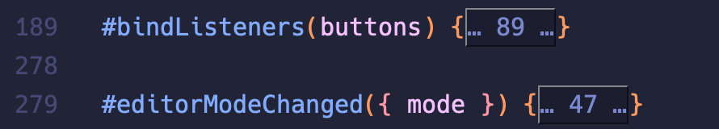
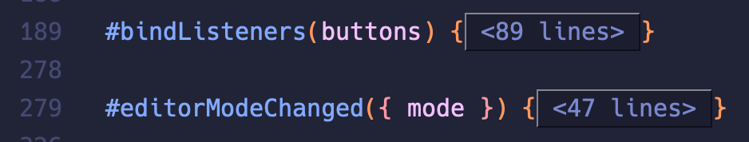

[](https://www.gnu.org/licenses/gpl-3.0)
[](https://jcs-emacs.github.io/jcs-elpa/#/treesit-fold)

# treesit-fold

> Code-folding using treesit

[](https://github.com/emacs-tree-sitter/treesit-fold/actions/workflows/test.yml)

`treesit-fold` builds on top of `treesit.el` to provide code folding based on
the tree-sitter syntax tree.

<p align="center">

</p>

<!-- Markdown is not able to render links with unicode so after refreshing the toc, select it and:
    `M-x replace-regexp #[^-a-zA-Z] <ret> # <ret>` -->

<!-- markdown-toc start - Don't edit this section. Run M-x markdown-toc-refresh-toc -->
**Table of Contents**

- [💾 Installation](#-installation)
  - [🔍 Method 1. with `straight.el` and `use-package`:](#-method-1-with-straightel-and-use-package)
  - [🔍 Method 2. Manual](#-method-2-manual)
- [🖥 Usage](#-usage)
  - [📇 Commands](#-commands)
  - [🔨 Supported languages](#-supported-languages)
    - [🚀 Add support for non-ts modes](#-add-support-for-non-ts-modes)
- [📝 Customization](#-customization)
  - [⚪ Folding on new nodes](#-folding-on-new-nodes)
    - [❔ Example](#-example)
    - [↔ Offset](#-offset)
  - [🔍 Writing new fold functions](#-writing-new-fold-functions)
  - [🔢 Line Count Display](#-line-count-display)
- [🔌 Plugins](#-plugins)
  - [⚖ Indicators Mode](#-indicators-mode)
    - [💾 Installation](#-installation-1)
    - [🖥 Usage](#-usage-1)
  - [📝 Summary](#-summary)
    - [🖥 Usage](#-usage-2)
    - [📝 Customization](#-customization-1)
  - [🌫 Line-Comment folding](#-line-comment-folding)
    - [🖥 Usage](#-usage-3)
- [🔰 Contribute](#-contribute)
  - [🔬 Development](#-development)
  - [❓ How to add a folding parser?](#-how-to-add-a-folding-parser)
    - [🔍 Where can I look for tree-sitter node?](#-where-can-i-look-for-tree-sitter-node)
  - [❓ How to create a summary parser?](#-how-to-create-a-summary-parser)
- [⚜️ License](#-license)

<!-- markdown-toc end -->

## 💾 Installation

### 🔍 Method 1. with `straight.el` and `use-package`:

```elisp
(use-package treesit-fold
  :straight (treesit-fold :type git :host github :repo "emacs-tree-sitter/treesit-fold"))
```

### 🔍 Method 2. Manual

```sh
git clone https://github.com/emacs-tree-sitter/treesit-fold /path/to/lib
```

then in Emacs:

```elisp
(add-to-list 'load-path "/path/to/lib")
(require treesit-fold)
```

or

```elisp
(use-package treesit-fold
  :load-path "/path/to/lib")
```

## 🖥 Usage

### 📇 Commands

The following are the functions provided by `treesit-fold-mode`

Commands for enabling `treesit-fold`:

| Commands                              | Description                                                                                                   |
|---------------------------------------|---------------------------------------------------------------------------------------------------------------|
| `treesit-fold-mode`                   | enable `treesit-fold-mode` in the current buffer.                                                             |
| `global-treesit-fold-mode`            | enable `treesit-fold-mode` whenever tree-sitter is turned on and the major mode is supported by treesit-fold. |
| `treesit-fold-indicators-mode`        | enable `treesit-fold` with indicators in the current buffer. See [plugins section](#-indicators-mode).        |
| `global-treesit-fold-indicators-mode` | enable `treesit-fold` with indicators globally. See [plugins section](#-indicators-mode).                     |
| `treesit-fold-line-comment-mode`      | enable line comment folding.                                                                                  |

Commands for using `treesit-fold`.

| Commands                        | Description                                                                   |
|---------------------------------|-------------------------------------------------------------------------------|
| `treesit-fold-close`            | fold the current syntax node.                                                 |
| `treesit-fold-open`             | open the outermost fold of the current syntax node. Keep the sub-folds close. |
| `treesit-fold-open-recursively` | open all folds inside the current syntax node.                                |
| `treesit-fold-close-all`        | close all foldable syntax nodes in the current buffer.                        |
| `treesit-fold-open-all`         | open all folded syntax nodes in the current buffer.                           |
| `treesit-fold-toggle`           | toggle the syntax node at `point'.                                            |

If evil mode is loaded, then these commands are also added to the evil folding list.

### 🔨 Supported languages

> ⚠️ Please sort these two lists alphabetically!

These languages are fairly complete:

- ActionScript / Arduino / Assembly
- Bash / Beancount
- C / C++ / C# / Clojure / CMake / CSS
- Dart
- Elisp / Elixir / Erlang
- Fish
- GDScript / Gleam / GLSL / Go / Groovy (Jenkinsfile)
- Haskell / Haxe / HEEx / HLSL / HTML
- Jai / Janet / Java / JavaScript / JSX / JSON / Jsonnet / Julia
- Kotlin
- LaTex / Lisp / Lua
- Make / MATLAB / Markdown / Mermaid
- Ninja / Nix / Noir
- OCaml / Org
- Perl / PHP / Python
- R / Ruby / Rust / reStructuredText
- Scala / Scheme / SQL / Svelte / Swift
- TOML / TypeScript / TSX
- Verilog / VHDL / Vimscript
- XML
- YAML
- Zig

These languages are in development:

- Ada
- Agda
- Elm
- Fortran
- Pascal
- Smithy

*P.S. We don't list trivial languages here. e.g., LLVM IR (`.ll`) files, etc.
Please see the variable `treesit-fold-range-alist` for the fully supported list!*

#### 🚀 Add support for non-ts modes
You can add folding support for non-ts modes (such as c-mode or emacs-lisp-mode),
this requires you have the parser library for the mode.
After, you can enable folding adding these code snippets to your configuration:

``` elisp
;; For `treesit-parser-create' you need to ensure the language fits with
;; the parser library (e.g `libtree-sitter-cpp.dll' is 'cpp).

(add-hook 'emacs-lisp-mode-hook (lambda () (treesit-parser-create 'elisp)))

;; For use-package users
(use-package treesit-fold
  :hook (c-mode . (lambda () (treesit-parser-create 'c)))
  ...)
```

## 📝 Customization

Although treesit-fold aims to have good folding out of the box for all supported
definitions, people will indubitably have their own preferences or desired
functionality. The following section outlines how to add your own folding
definitions and folding functions to make treesit-fold work for you. If there are any
improvements you find for existing or new languages, please do raise a PR so
that others may benefit from better folding in the future!

### ⚪ Folding on new nodes

Treesit-fold defines all its folding definitions in the variable
`treesit-fold-range-alist` which is an alist with the key of the alist being the
mode and the value being another alist of fold definitions.

```elisp
;; Example of treesit-fold-range-alist's structure
'((c-mode     . c-folding-definitions) ;; <language>-folding-definitions is structured as shown below
  (css-mode   . css-folding-definitions)
  (go-mode    . go-folding-definitions)
  (scala-mode . scala-folding-definitions)
  ...)

;; Examle of a folding definition alist
(setq css-folding-definitions
    (block   . treesit-fold-range-seq)
    (comment . treesit-fold-range-c-like-comment))
```

So you can select whatever node that you want to fold on it.

To find what node you'll want to fold closed, refer to the
[Emacs tree-sitter documentation](https://www.gnu.org/software/emacs/manual/html_node/elisp/Pattern-Matching.html)
about viewing nodes. `treesit-inspect-mode` and `treesit-explore-mode`
are both very useful for this.

For the folding functions, treesit-fold provides some default

- `treesit-fold-range-seq` - Folds from the start of the node to the end of the node
  leaving a buffer of one character on each side. Usually used for code blocks
  that have bracketing delimiters.

  ```c++
  int main() { // <-- start of tree-sitter block node
      printf("Hello, World\n");
      return 0;
  } // <-- end of tree-sitter block node

  // |
  // | '(block . treesit-fold-range-seq)
  // V

  int main() {...} // Folded node
  ```

- `treesit-fold-range-markers` - Folds the node starting from a giving delimiter
  character. Useful if tree-sitter's node definition doesn't align with the
  start of the desired folding section.

  **NOTE:** This folding function requires a lambda (or an externally
  defined function wrapper) so that the delimiter can be specified. You
  usually don't need to worry about the `node` and `offset` variables, so just
  pass them through.

```go
type Dog interface {
    Bark() (string, error)
    Beg() (bool, error)
}

/* | Note: The tree-sitter node starts at the word interface, not at the '{'.
 * | '(interface_type . (lambda (node offset)
 * |                      (treesit-fold-range-markers node offset "{" "}")))
 * V
 */

type Dog interface {...}
```

- `treesit-fold-range-block-comment` - Folds multi-line comments that are of the form
  `/*...*/`. Should show a summary if the commentary plugin is turned on.

  ```c++
  /*
   * The main function that gets run after program is compiled
   * Doesn't take any parameters
   */
  int main() {
      printf("Hello, World\n");
      return 0;
  }

  // |
  // | '(comment . treesit-fold-range-block-comment)
  // V

  /* <S> The main function that gets run after program is compiled */
  int main() {
      printf("Hello, World\n");
      return 0;
  ```

- `treesit-fold-range-line-comment` - For languages that have one line comment blocks
  with the comment delimiter starting each line. Condenses all the comment nodes
  into a single fold.

  **Note:** This folding function requires a lambda (or an externally
  defined function wrapper) so that the delimiter can be specified. You
  usually don't need to worry about the `node` and `offset` variables, so just
  pass them through.

  ```sh
  # show the long form of ls
  # and also display hidden files
  alias ll='ls -lah'

  # |
  # | (comment (lambda (node offset) (treesit-fold-range-line-comment node offset "#"))))
  # V

  # show the long form of ls...
  alias ll='ls -lah'
  ```

- `treesit-fold-range-c-like-comment` - A shortcut for the large number of languages
  that have the c style comment structures `/*...*/` and `// ...`. Smartly picks
  the correct folding style for the comment on the line.

  ```c++
  /*
   * The main function that gets run after program is compiled
   * Doesn't take any parameters
   */
  int main() {
      // print hello world
      // and a new line
      printf("Hello, World\n");
      return 0;
  }

  // |
  // | '(comment . treesit-fold-range-c-like-comment)
  // V

  /* <S> The main function that gets run after program is compiled */
  int main() {
      // <S> print hello world
      printf("Hello, World\n");
      return 0;
  ```

Now that you know what kinds of folds are easily available in treesit-fold, you can
go ahead and add new fold definitions to `treesit-fold-range-alist` and be good to go!

#### ❔ Example

Let's look at a quick example of adding a new folding definition. Let's say you
want to add folding to `go-mode`'s `field_declaration_list`. The folding
definition that is needed will be
`'(field_declaration_list . treesit-fold-range-seq)`. To add this to the
`treesit-fold-range-alist`, you can do something like the following.

```emacs-lisp
(push '(field_declaration_list . treesit-fold-range-seq) (alist-get 'go-mode treesit-fold-range-alist))
```

Now the new fold definition should be usable by treesit-fold!

#### ↔ Offset

With the functions listed above you'll be able to define most folding behavior
that you'll want for most languages. However, sometimes you'll have a language
where the delimiter is a word instead of a single character bracket and you want
to offset your fold by a certain amount to accommodate it. That's where offsets
come in. When adding a fold definition to a a language's fold alist, you can
either provide the folding function directly as you've seen so far:

```elisp
'(block . treesit-fold-range-seq)
```

Or you can provide the folding function with an offset:

```elisp
'(block . (treesit-fold-range-seq 1 -3))
```

When a range is provided, it provides extra room on the ends of a fold. The way
this works is most easily shown using an example. Lets say we want to write a
fold for bash's `for...do...done` construct to look something like this:

```sh
for i in 1 2 3 4 5
do
   echo "Welcome $i times"
done

# |
# | '(do_group . <some folding function>)
# V

for i in 1 2 3 4 5
do...done
```

The `do...done` block is represented in tree-sitter as the node named
`do_group`. However, if we just use `'(do_group . treesit-fold-range-seq)`, then
we'll get results like the following:

```emacs-lisp
for i in 1 2 3 4 5
d...e
```

which is hard to read. Instead, we can use the definition
`'(do_group . (treesit-fold-range-seq 1 -3))` to offset the fold a bit to get our
desired result!

### 🔍 Writing new fold functions

If the built in functions don't fit your needs, you can write your own fold
parser! Folding functions take two parameters:

- `node` - the targeted tree-sitter node; in this example, `block` will be the
  targeting node.
- `offset` - (optional) a cons of two integers. This is handy when you have
  a similar rule with little of positioning adjustment.

Then the function needs to return a position range for the fold overlay in the
form `'(start-of-fold . end-of-fold)`. If `nil` is returned instead of a range,
then no fold is created. This can be useful if you want to add extra conditional
logic onto your fold.

As an example of a folding function, take a look at the definition of the
basic `treesit-fold-range-seq`.

```elisp
(defun treesit-fold-range-seq (node offset)
  "..."
  (let ((beg (1+ (treesit-node-start node)))  ; node beginning position
        (end (1- (treesit-node-end node))))   ; node end position
    (treesit-fold--cons-add (cons beg end) offset)))    ; return fold range
```

### 🔢 Line Count Display

The following variables let you toggle and customize the display of the line count for folded regions.

- `treesit-fold-line-count-show`

  This variable controls whether or not the number of lines in a folded text region is displayed.

  Type: `boolean`

  Default: `nil` (line count is not shown)

  If set to `t`, the number of lines in folded regions will be shown.

  Example:
  ```elisp
  (setq treesit-fold-line-count-show t)  ; Show line count in folded regions
  ```
  <p align="center">
  
  </p>

- `treesit-fold-line-count-format`

  This variable defines the format string used for displaying the line
  count in folded text. The `%d` will be replaced with the actual number
  of lines in the folded region.

  Type: `string`

  Default: `(concat (truncate-string-ellipsis) " %d " (truncate-string-ellipsis))`

  Example:

  ```elisp
  (setq treesit-fold-line-count-format " <%d lines> ")
  ```

  <p align="center">
  
  </p>

## 🔌 Plugins

treesit-fold comes with a couple of useful little additions that can be used or
turned off as desired.

### ⚖ Indicators Mode

<p align="center">

</p>

This plugin adds interactive visual markers in the gutter that show where folds
can be made. They can be clicked on to fold or unfold given nodes.

#### 💾 Installation

`treesit-fold-indicator-mode` is loaded when `treesit-fold-mode` is and the functionality
should be auto-loaded in, however if that's not working then you may want to
explicitly declare the package in in your config.

- `use-package`

  ```elisp
  (use-package treesit-fold-indicators
  :straight (treesit-fold-indicators :type git :host github :repo "emacs-tree-sitter/treesit-fold"))
  ```

- ```elisp
  (add-to-list 'load-path "/path/to/lib")
  (require treesit-fold)
  ```

  or

  ```elisp
  (use-package treesit-fold-indicators
     :load-path "/path/to/lib")
  ```

#### 🖥 Usage

You can then enable this manually by doing either of the following:

```
M-x treesit-fold-indicators-mode

M-x global-treesit-fold-indicators-mode
```

Please note that turning on `treesit-fold-indicators-mode` automatically turns on
`treesit-fold-mode` as well. Though, turning off `treesit-fold-indicators-mode` does not
turn off `treesit-fold-mode`

- To enable this automatically whenever a buffer has a tree-sitter parser, use the global indicator mode:

  ```elisp
  (global-treesit-fold-indicators-mode 1)
  ```

  Else, you can add a hook directly.

  ```elisp
  (add-hook 'c-ts-mode-hook #'treesit-fold-indicators-mode)
  ```

- To switch to left/right fringe: (Default is `left-fringe`)

  ```elisp
  (setq treesit-fold-indicators-fringe 'right-fringe)
  ```

- To lower/higher the fringe overlay's priority: (Default is `30`)

  ```elisp
  (setq treesit-fold-indicators-priority 30)
  ```

- To apply different faces depending on some conditions: (Default is `nil`)

  For example, to coordinate [line-reminder](https://github.com/emacs-vs/line-reminder)
  with this plugin.

  ```elisp
  (setq treesit-fold-indicators-face-function
        (lambda (pos &rest _)
          ;; Return the face of it's function.
          (line-reminder--get-face (line-number-at-pos pos t))))

  (setq line-reminder-add-line-function
        (lambda (&rest _)
          (null (treesit-fold--overlays-in treesit-fold-indicators-window (selected-window)
                                      (line-beginning-position) (line-end-position)))))
  ```

### 📝 Summary

<p align="center">

</p>

This plugin automatically extracts summary from the comment/document string,
so you can have a nice way to peek at what's inside the fold range.

#### 🖥 Usage

- If you don't want this to happen, do: (Default is `t`)

  ```elisp
  (setq treesit-fold-summary-show nil)
  ```

- Summary are truncated by length: (Default is `60`)

  ```elisp
  (setq treesit-fold-summary-max-length 60)
  ```

- The exceeding string are replace by: (Default is `"..."`)

  ```elisp
  (setq treesit-fold-summary-exceeded-string "...")
  ```

- To change summary format: (Default is `" <S> %s "`)

  ```elisp
  (setq treesit-fold-summary-format " <S> %s ")
  ```

#### 📝 Customization

Just like with fold definitions, you can create your own summary definitions.
Summary definitions are defined in `treesit-fold-summary-parsers-alist` and has one
summary function per major mode `'(java-mode . fold-summary-function)`. The
summary function takes in the doc string which is all the text from a doc node
and then returns a string to be displayed in its stead. Unlike with the folding
functions, there aren't a set of general summary functions to fall back on.
However, there are lots of examples and helper functions present in
`treesit-fold-summary.el`. Let's look at one example here.

```emacs-lisp
(defun treesit-fold-summary-javadoc (doc-str)
  "Extract summary from DOC-STR in Javadoc."
  (treesit-fold-summary--generic doc-str "*")) ;; strip the '*' and returns the first line
```

As can be seen `treesit-fold-summary--generic` is a very helpful function since it
removes the provided delimiter and returns the first line. often this will be
enough.

### 🌫 Line-Comment folding

<p align="center">

</p>

This plugin makes line comment into foldable range.

#### 🖥 Usage

  ```
  M-x treesit-fold-line-comment-mode
  ```

## 🔰 Contribute

[](http://makeapullrequest.com)
[](https://github.com/bbatsov/emacs-lisp-style-guide)
[](https://www.paypal.me/jcs090218)
[](https://www.patreon.com/jcs090218)

Ensure your buffer has a tree-sitter parser first, then `treesit-explore-mode` is useful to test
out queries that determine what syntax nodes should be foldable and how to fold
them. [Emacs repository](https://git.savannah.gnu.org/cgit/emacs.git/tree/admin/notes/tree-sitter/starter-guide#n130) and [Emacs tree-sitter manual](https://www.gnu.org/software/emacs/manual/html_node/elisp/Pattern-Matching.html)
has an excellent documentation on how to write `tree-sitter` queries.

### 🔬 Development

To run the test locally, you will need the following tools:

- [Eask](https://emacs-eask.github.io/)
- [Make](https://www.gnu.org/software/make/) (optional)

Install all dependencies and development dependencies:

```sh
$ eask install-deps --dev
```

To test the package's installation:

```sh
$ eask package
$ eask install
```

To test compilation:

```sh
$ eask compile
```

**🪧 The following steps are optional, but we recommend you follow these lint results!**

The built-in `checkdoc` linter:

```sh
$ eask lint checkdoc
```

The standard `package` linter:

```sh
$ eask lint package
```

*📝 P.S. For more information, find the Eask manual at https://emacs-eask.github.io/.*

### ❓ How to add a folding parser?

When adding a new folding parser, add the folding definition function to
`treesit-fold.el` itself near where the other range functions live and then add the
parser to `treesit-fold-parsers.el` file. Finally, if you are adding support for a
new language, remember to add it to the `treesit-fold-range-alist` variable.

When creating a new parser, name it `treesit-fold-parsers-<language>`.

When creating a new folding function, name it
`treesit-fold-range-<language>-<feature>` or something similar.

#### 🔍 Where can I look for tree-sitter node?

Here are some techniques for finding your desired nodes in tree-sitter.

To look for the correct node you have three options:

- look at the `tree-sitter-[lang]/grammar.js` implementation. In the above
  example, `block` node is defined in the
  [tree-sitter-c-sharp](https://github.com/tree-sitter/tree-sitter-c-sharp)'s
  `grammar.js` file.
- open a file of your language choice (ensure that it has a tree-sitter parser) in emacs and `M-x treesit-explore-mode`.
  This will display a buffer with the whole s-expr representing nodes at point from the current file/buffer.
- `M-x treesit-inspect-node-at-point` in your function to display what your
  function is seeing.
- use `M-x treesit-inspect-mode` which diplay in the mode-line the current node at point.

> [!WARNING]
>
> Make sure you look into the correct repository. Some repositories are managed
> under https://github.com/tree-sitter/[lang].

### ❓ How to create a summary parser?

`treesit-fold-summary.el` module is used to extract and display a short description
from the comment/docstring.

To create a summary parser, you just have to create a function that could
extract comment syntax correctly then register this function to
`treesit-fold-summary-parsers-alist` defined in `treesit-fold-summary.el`.
The display and shortening will be handled by the module itself.

Functions should be named with the prefix `treesit-fold-summary-` followed by
`style name`. For example, to create a summary parser for Javadoc style, then it
should be named `treesit-fold-summary-javadoc`.

## ⚜️ License

This program is free software; you can redistribute it and/or modify
it under the terms of the GNU General Public License as published by
the Free Software Foundation, either version 3 of the License, or
(at your option) any later version.

This program is distributed in the hope that it will be useful,
but WITHOUT ANY WARRANTY; without even the implied warranty of
MERCHANTABILITY or FITNESS FOR A PARTICULAR PURPOSE.  See the
GNU General Public License for more details.

You should have received a copy of the GNU General Public License
along with this program.  If not, see <https://www.gnu.org/licenses/>.

See [`LICENSE`](./LICENSE.txt) for details.
